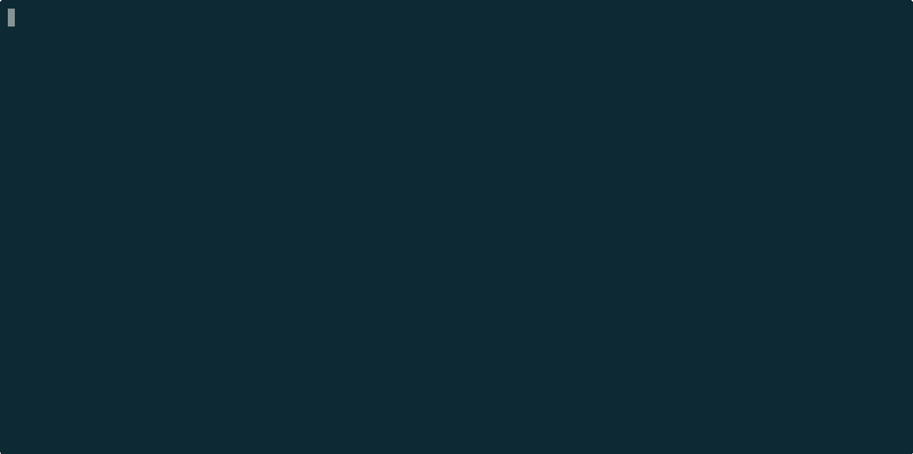

[](https://github.com/renjfk/tash/actions/workflows/ci.yml)
[](https://codecov.io/gh/renjfk/tash)
[](LICENSE)
[](https://github.com/renjfk/tash/releases/latest)
[](https://github.com/renjfk/tash/releases)

<h1 align="center">(◕‿◕)</h1>

# tash

Meet tash (**T**erminal **A**ssistant **Sh**ell). Your personal AI assistant living at the heart of your shell.
If you are a fish shell user, this is the perfect match for you.



## Motivation

I initially designed tash as a toy project to introduce AI to my daughter, who owns a desktop Raspberry Pi 4 with
only a terminal interface running fish shell. It turned into something genuinely useful for me; someone who spends
most of the time in a terminal window.

## What It Is

tash is a lightweight fish shell middleware that intercepts unknown commands, queries an AI for suggestions, and places
the result directly into your command line buffer for you to review, edit, or run.

- Understands natural language; just type what you want to do
- Suggests shell commands with explanations when helpful
- Remembers your recent shell activity and carries context across sessions
- Builds a profile from your shell history and learns more about you over time
- Searches your history on its own when it needs more context (agentic history lookup)
- Validates suggested commands against your actual PATH before showing them
- Handles multi-step tasks with interactive approval for each step
- Works with any OpenAI-compatible API endpoint
- Single binary, zero shell startup cost, minimal dependencies

## What It Is Not

tash is not a full-featured coding agent. Tools like [opencode](https://opencode.ai/)
and [Claude Code](https://code.claude.com/) are perfectly capable of complex software engineering tasks; there is no
need to reinvent the wheel.

As a matter of fact, most of the tash codebase was written with opencode; you may have guessed from the
Knight Rider spinner.

```
(◕‿◕) ⬝⬝⬝⬝⬝■■■ Thinking...
```

tash stays in its lane: quick command suggestions and shell-level chat, right where you type.

## Installation

### Requirements

- [fish shell](https://fishshell.com/)

### Homebrew

```bash
brew install renjfk/tap/tash
```

### Script

```bash
curl -fsSL https://raw.githubusercontent.com/renjfk/tash/main/install.fish | fish
```

### Building from Source

```bash
git clone https://github.com/renjfk/tash.git
cd tash
make build
```

The binary outputs to `bin/tash`.

## Setup

> [!IMPORTANT]
> Set your API key before running `tash init`:
> ```bash
> set -Ux ANTHROPIC_API_KEY your-key
> ```

`tash init` generates your user profile from shell history, creates a default config, and installs fish hooks
into `~/.config/fish/conf.d/tash.fish`. Two abbreviations are added:

- `t` expands to the tash binary
- `q` is a shortcut for `tash query`

Unknown commands are routed to tash via `fish_command_not_found`. When `auto_intercept` is enabled (default),
failed commands that look like natural language are also intercepted automatically.

Suggested commands are placed into the fish command line buffer; you always have final control to review, edit,
or run them before pressing Enter.

### Subcommands

| Command                | Description                                 |
|------------------------|---------------------------------------------|
| `tash query <input>`   | Ask the AI for a command or chat            |
| `tash usage [--reset]` | Show or reset token usage stats             |
| `tash reset`           | Clear conversation history (keeps memories) |
| `tash clear`           | Clear everything (conversation + memories)  |
| `tash version`         | Print version                               |

### Configuration

Config lives at `~/.config/tash/config.yaml` and is created on `tash init`. The generated file includes
inline comments describing each field and its valid values. Invalid values are silently reset to defaults.

| Field                               | Description                                                    |
|-------------------------------------|----------------------------------------------------------------|
| `model.name`                        | Any model supported by the configured endpoint                 |
| `model.endpoint`                    | Any OpenAI-compatible API (Anthropic, OpenAI, Ollama, etc.)    |
| `model.api_key_env`                 | Environment variable holding the API key                       |
| `behavior.auto_intercept`           | Automatically intercept failed natural language commands       |
| `behavior.max_memories`             | Durable facts the AI remembers about you across sessions       |
| `behavior.screen_capture`           | Capture terminal screen content for AI context                 |
| `behavior.screen_capture_max_lines` | Maximum lines to capture from terminal screen                  |
| `profile.rebuild_interval`          | Seconds between background profile rebuilds from shell history |
| `theme.name`                        | Preset theme (see comments in config for full list)            |
| `theme.color`                       | Custom hex color, overrides theme name                         |
| `terminal.ascii`                    | Use ASCII-only characters for limited Unicode terminals        |
| `terminal.color`                    | Color profile override: `auto`, `256`, `16`, `none`            |

Available themes: `solarized` `gruvbox` `nord` `dracula` `monokai` `catppuccin`
`tokyo-night` `rose-pine` `kanagawa` `everforest` `onedark` `nightfox`

### Data Directory

All state is stored in `~/.config/tash/`:

| File                 | Description                                                       |
|----------------------|-------------------------------------------------------------------|
| `config.yaml`        | User configuration                                                |
| `profile.md`         | AI-generated user profile (system info, tools, frequent commands) |
| `conversation.jsonl` | Conversation history (append-only)                                |
| `usage.json`         | Token usage statistics                                            |
| `tash.log`           | Log file (rotates at 5MB)                                         |

## Uninstalling

### Homebrew

```bash
brew uninstall tash
rm -f ~/.config/fish/conf.d/tash.fish
rm -rf ~/.config/tash/
```

### Manual

```bash
rm -f ~/.local/bin/tash
rm -f ~/.config/fish/conf.d/tash.fish
rm -rf ~/.config/tash/
```

## Contributing

tash is open to contributions and ideas! Whether you're a developer wanting to add features or a user with suggestions,
your input is valuable.

### Issue Conventions

When creating issues, please follow our simple naming convention:

**Format:** `type: brief description`

#### Issue Types

- `feat:` - New features or functionality
- `fix:` - Bug fixes
- `enhance:` - Improvements to existing features
- `chore:` - Maintenance tasks, dependencies, cleanup
- `docs:` - Documentation updates
- `build:` - Build system, CI/CD changes

#### Examples

- `feat: add CSV export functionality`
- `fix: app crashes when importing large files`
- `enhance: improve data loading performance`
- `chore: update dependencies to latest versions`
- `docs: update README with installation instructions`
- `build: update Xcode project settings`

#### Guidelines

- Use lowercase for the description
- Be specific and actionable
- Keep under 60 characters
- No period at the end

## Development

### Release Process

Manual releases via opencode; see [RELEASE_PROCESS.md](RELEASE_PROCESS.md).

## License

This project is licensed under the [MIT License](LICENSE).
